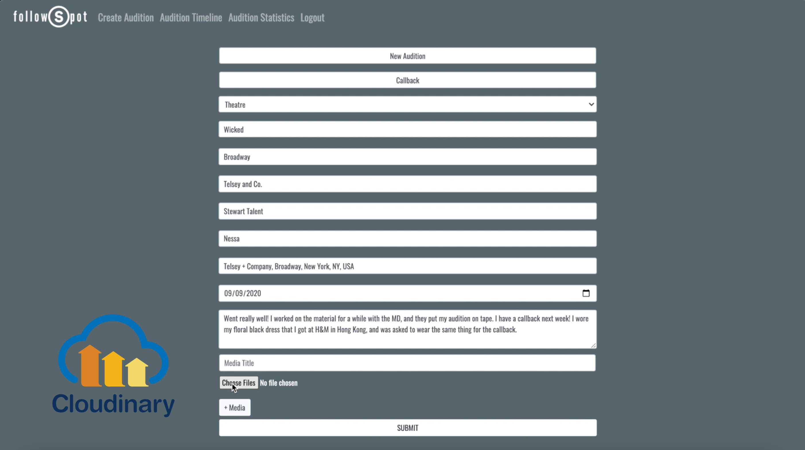

Built by: [Jen Brissman](https://www.linkedin.com/in/jenbrissman/) | [brissman514@gmail.com](mailto:brissman514@gmail.com?subject=[GitHub]%20FollowSpot) | [Watch the demo!](https://www.youtube.com/watch?v=AkxajodTJZs&t=23s)

Table of Contents
------
[Tech Stack](#tech-stack) | [About](#about) | [Features](#features) | [Installation](#installation)

Tech Stack
------
| <!-- -->    | <!-- -->    |
|:-------------|:-------------|
| **APIs and Libraries**  | Cloudinary, Twilio, GoogleMaps, Chart.js |
| **Backend**             | Python3, Flask, SQLAlchemy, Jinja2 |
| **Frontend**            | JavaScript, jQuery, HTML5, CSS, Bootstrap |
| **Database**            | PostgreSQL |
| <!-- -->    | <!-- -->    |

About
------

FollowSpot is a comprehensive audition tracking web application for entertainment industry professionals.

Features
------
### Login and Registration
Allow the user to create an account to store all of their audition information and materials. I have integrated the Twilio API to send the user an SMS message confirming their connection to the app.

### Audition Timeline
To develop a responsive and user friendly interface - I styled FollowSpot with Bootstrap and my own custom CSS. I provide the user with a collection of thoughtfully designed cards which contain all the information about a specific audition. My design uses Jinja templating to dynamically load the data onto individual cards, which I've sorted in reverse chronological order.  

To filter through the cards, I developed a search feature by adding a JavaScript event listener that evaluates keystrokes to hide the cards that do not contain text matching the query string.

### Input Forms
To collect the user's data, I built a responsive form which provides intuitive prompts. The first of which is whether the audition is an initial audition or a callback. When a user clicks on the callback button, an on-click event triggers a drop down to appear with previously logged projects, which the user can then select.

I implemented jQuery to auto-populate certain text fields with response data returned from my server via a get request made to my API. By integrating Cloudinary’s media management API, I am able to offer the user the option of uploading any number or type of media files pertaining to their audition. In order to correctly populate the tables in my database, promises returned from both my API and Cloudinary’s needed to be handled in a synchronized manner using a series of async/await fetch requests. I originally wrote this code with a series of nested fetches, but refactoring with async/await allowed me to store the responses in variables, which proved to be very helpful for debugging.

I also implemented Google’s Map & Places API with their Place Autocomplete service.

### Audition Statistics
I used the ChartJS data visualization library to build statistical representations of the user's auditions. The bar chart represents the total number of auditions logged by the user over time, while the two doughnut charts break auditions down by industry and agency. I was able to display the data by month and by year while giving each year its own color by putting the data into a nested object and parsing through it.

### Looking Ahead
Moving forward, I will be continuing to develop my application’s use of the Twilio API to allow users to better share an audition card via SMS.
